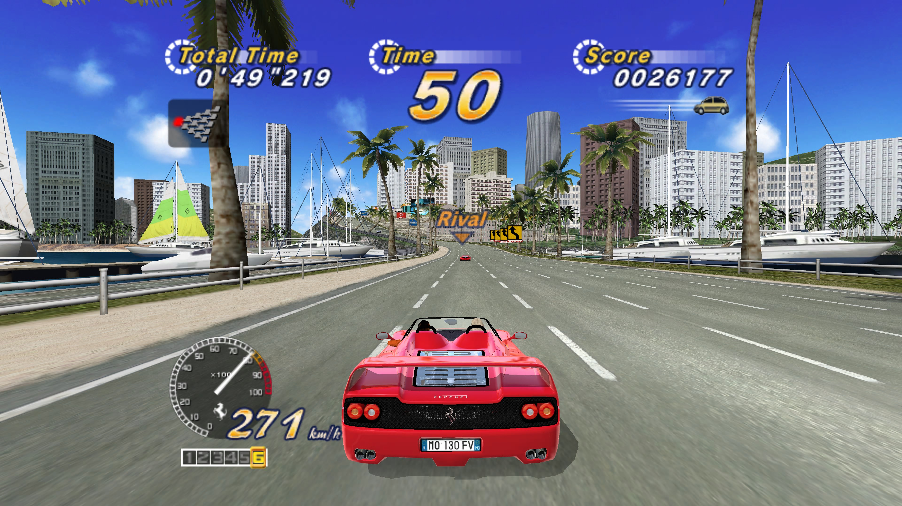
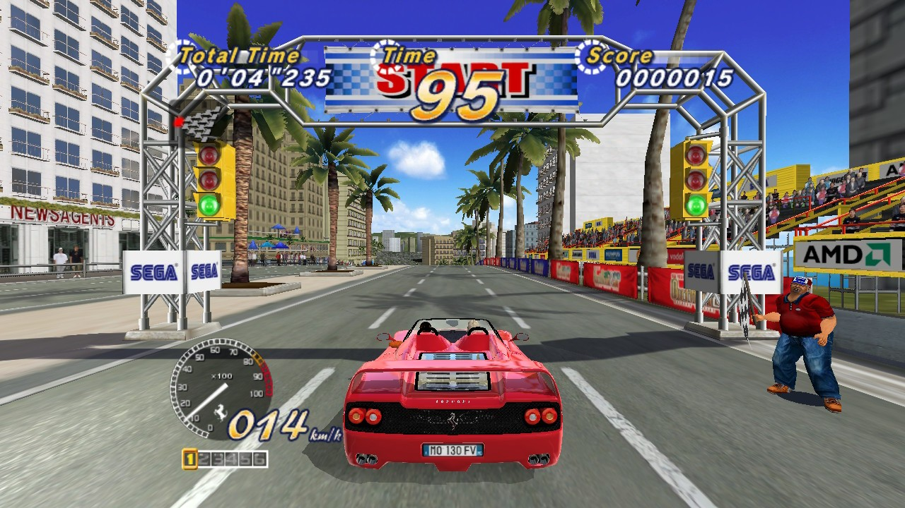

# Status #

It is not finished yet, so bugs are to be expected.
Some menus are incorrect, and some visual effects, performance-related aspects,
game behaviors, and functionality are not final yet.
Some early enhancements have already been added, including:
- multiple anti-aliasing methods
- multiple resolution options
- widescreen support
- 120 FPS support

Once the decompilation is complete and the remaining issues are fixed,
additional enhancements will be added, including features from at least:
https://github.com/emoose/OutRun2006Tweaks

# OutRun 2006 Coast 2 Coast: native port

A native port of the PC version of OutRun 2006 Coast 2 Coast (Sumo Digital /
Sega, 2006) to Nintendo Switch, macOS (Apple silicon), PS5 (homebrew) and
Xbox One / Series (Developer Mode). The game code is a reconstruction of the
PC executable in C++ (part of it still translated from x86 by `tools/x86tr`,
the rest written by hand); the platform layer (graphics, audio, input,
files, network) is native to each system.

This repository holds code only. **It contains no game data and no part of
the original executable.** To play, you need your own copy of the game
(Steam version).

## What you need from your game

- The folder of your OutRun 2006 Coast 2 Coast installation (Steam).
- Its `OR2006C2C.EXE`. The port reads code tables and constants from it at
  the first launch, checks every range it uses against SHA-256 hashes
  (`src/system/exe_image_ranges.inc`), then keeps a prepared image,
  `OR2006C2C.cache`, in the game folder. Later launches only read that file.

The game files are read in place and never modified; `OR2006C2C.cache` can be
deleted at any time and is rebuilt at the next launch.

## Layout

| Folder | Content |
| --- | --- |
| `src/driving`, `src/platform` | the game code, ported function by function (`*_tr.cpp`: code still translated from x86) |
| `src/*.cpp` (`control`, `asset_views`, `pc_pmt`) | input control, asset views and the PC model (PMT) loader shared by the game code |
| `src/recomp` | runtime of the translated code (`x86rt.hpp`: guest registers, memory, flags) |
| `src/system` | files, clocks, EXE image loading and checking, first-launch setup screen |
| `src/ports` | in-memory extraction of the Steam `OR2006C2C.EXE` (see its `README.md`) |
| `src/runtime` | the shared game runner (`game_host`) used by every platform |
| `src/input` | pad and lifecycle adapter shared by the Mac and PS5 builds |
| `src/enhancements` | port additions kept apart from the reconstructed game: extra Options > Settings rows (aspect ratio, resolution, anti-aliasing, frame rate); each platform lists what it supports (`enhancements_*.cpp` in its `source/`) |
| `switch/`, `mac/`, `ps5/`, `xbox/` | one folder per platform, same layout in each |
| `tests/` | unit and regression tests (CTest) |
| `tools/` | EXE image tools, leak check, x86 translator, decompilation tracking, generators, PS5 build and package scripts |
| `images/` | screenshots |

Each platform folder has `source/` (platform code), `tests/`, `tools/`,
`third_party/` where needed, its build file and a `README.md` on how to
build and install it. Shader sources are in `switch/shaders` and
`ps5/shaders`; the Mac, PS5 and Xbox builds generate their shaders from
them (Metal, SPIR-V, HLSL). `ps5/title` builds the PS5 native title,
`ps5/sce_sys` holds its tile and backgrounds, `xbox/package` the UWP
manifest and logos.

`icon.png` and `bg.png` are the project's icon and background.
`tools/make_icons.ps1` derives each platform's images from them, at the
size and format each one expects: the Switch NRO icon, the PS5 tile and
backgrounds, the Xbox package logos and the Mac application icon.

## Building

| Platform | Command | Details |
| --- | --- | --- |
| Nintendo Switch | `make -C switch` | `switch/README.md` |
| macOS | `cmake --preset mac-full` | `mac/README.md` |
| PS5 | `Build-PS5.ps1` (Windows + WSL; makes the `.pkg`) | `ps5/README.md` |
| Xbox | `cmake` with `-DOR2_XBOX=ON` (Visual Studio 2026, UWP) | `xbox/README.md` |

Linux host (runner and tests):

    cmake -S . -B build -G Ninja -DOR2_EXE=<your OR2006C2C.EXE> \
        -DOR2_PC_ASSET_ROOT=<your game folder>
    cmake --build build
    ctest --test-dir build

Tests that need the game files take them from these two settings.

## Leak check

`tools/leak_check.py <your OR2006C2C.EXE> <built binary> --allow tools/leak_check_allow.txt`
verifies that no byte run of the original executable is compiled into a binary.

## Credits

Inspired and using tweaks by [OutRun2006Tweaks](https://github.com/emoose/OutRun2006Tweaks)
by emoose. See `THIRD_PARTY_NOTICES.md`.

OutRun is a trademark of Sega. This project is not affiliated with or endorsed by Sega or Sumo Digital.

This source code is be freely available for use, modification, and redistribution, subject to the licenses of the original projects it is based on.

Feel free to reuse any part of this project in your own work. Please give proper credit where due.

If you reuse our modifications, please keep an appropriate reference to this project and its contributors.

This project is developed and maintained in my free time.

If you enjoy the project and would like to support its development, donations are appreciated but entirely optional:

https://ko-fi.com/r4dius
